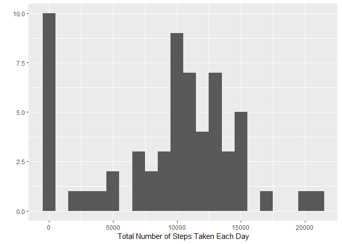
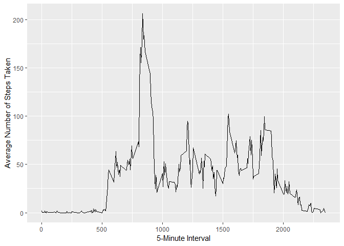
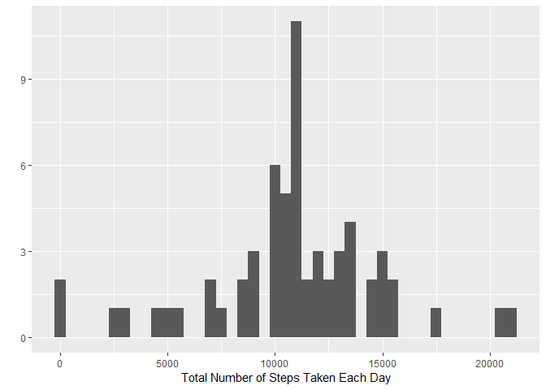
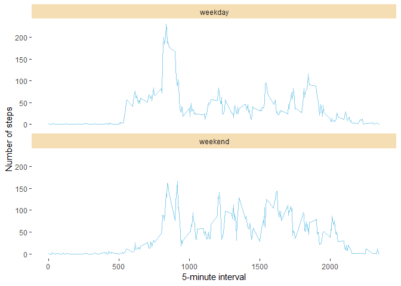

setwd("D:/Programs/R/WD/Assignments/Reproducable Research/Week 2/RepData_PeerAssessment1")
echo=TRUE 
## Loading and preprocessing the data

```r
library(ggplot2)
```

```
## Warning: package 'ggplot2' was built under R version 3.5.1
```

```r
if(!file.exists('activity.csv')){
    unzip('activity.zip')
}
activity <- read.csv('activity.csv')
```
## What is mean total number of steps taken per day?
Calculate the total number of steps taken per day

```r
totalsteps<-tapply(activity$steps,activity$date, FUN=sum, na.rm=TRUE)
```
Make a histogram of the total number of steps taken each day

```r
qplot(totalsteps,binwidth=1000, xlab="Total Number of Steps Taken Each Day")
```

<!-- -->
Calculate and report the mean and median of the total number of steps taken per day


```r
mean(totalsteps,na.rm=TRUE)
```

```
## [1] 9354.23
```

```r
median(totalsteps, na.rm=TRUE)
```

```
## [1] 10395
```
## What is the average daily activity pattern?
* Make a time series plot (i.e. type = "l") of the 5-minute interval (x-axis) and the average number of steps taken, averaged across all days (y-axis)

```r
averagedaily<-aggregate(x=list(steps=activity$steps), by=list(interval=activity$interval), FUN=mean, na.rm=TRUE)

ggplot(data=averagedaily, aes(x=interval,y=steps))+geom_line()+ xlab("5-Minute Interval")+ylab("Average Number of Steps Taken")
```

<!-- -->
Which 5-minute interval, on average across all the days in the dataset, contains the maximum number of steps?

```r
averagedaily[which.max(averagedaily$steps),]
```

```
##     interval    steps
## 104      835 206.1698
```
## Imputing missing values
Calculate and report the total number of missing values in the dataset (i.e. the total number of rows with \color{red}{\verb|NA|}NAs)

```r
missing<-is.na(activity$steps)
table(missing)
```

```
## missing
## FALSE  TRUE 
## 15264  2304
```
All missing values are populated with the mean for that 5-minute interval

```r
fillvalue<-function(steps, interval){
  filled<-NA
  if(!is.na(steps))
    filled<-c(steps)
  else
    filled<-(averagedaily[averagedaily$interval==interval, "steps"])
  return(filled)
}
filleddata<-activity
filleddata$steps<-mapply(fillvalue, filleddata$steps, filleddata$interval)
```
Make a histogram of the total number of steps taken each day and Calculate and report 

```r
totalsteps<-tapply(filleddata$steps, filleddata$date, FUN=sum)
qplot(totalsteps,binwidth=500,xlab="Total Number of Steps Taken Each Day")
```

<!-- -->

```r
mean(totalsteps)
```

```
## [1] 10766.19
```

```r
median(totalsteps)
```

```
## [1] 10766.19
```
The values differ due to having a higher count of values at the average of the filled data. The effect would be a much more predictable result.


## Are there differences in activity patterns between weekdays and weekends?
Find the days of the week for each measurement.


```r
wkdayorwkend <- function(date) {
    day <- weekdays(date)
    if (day %in% c("Monday", "Tuesday", "Wednesday", "Thursday", "Friday"))
        return("weekday")
    else if (day %in% c("Saturday", "Sunday"))
        return("weekend")
    else
        stop("invalid date")
}
filleddata$date <- as.Date(filleddata$date)
filleddata$day <- sapply(filleddata$date, FUN=wkdayorwkend)
```

Create a wrap of weekday vs weekend average steps.

```r
averages <- aggregate(steps ~ interval + day, data=filleddata, mean)
ggplot(averages, aes(interval, steps)) + geom_line(color = "sky blue") + facet_wrap(day ~ .,ncol=1) +
    xlab("5-minute interval") + ylab("Number of steps")+  theme(panel.grid.major = element_blank(),
        panel.grid.minor = element_blank(),panel.background = element_blank(),
               strip.background = element_rect(fill="wheat")
        )
```

<!-- -->
